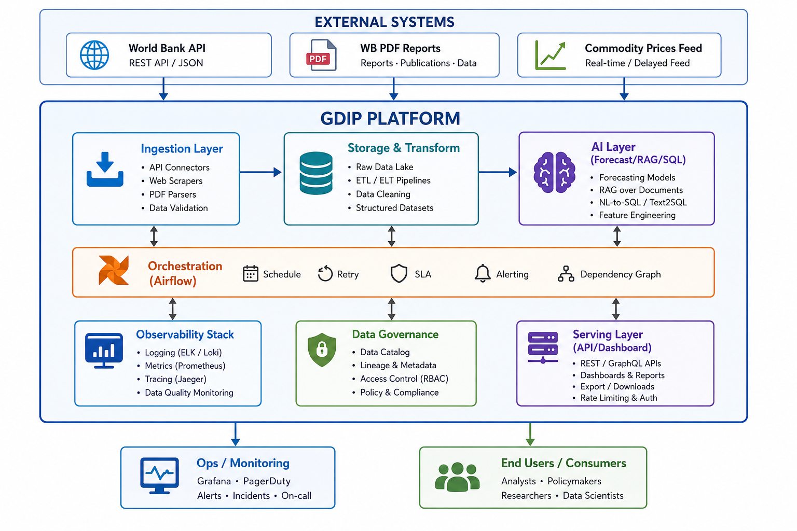
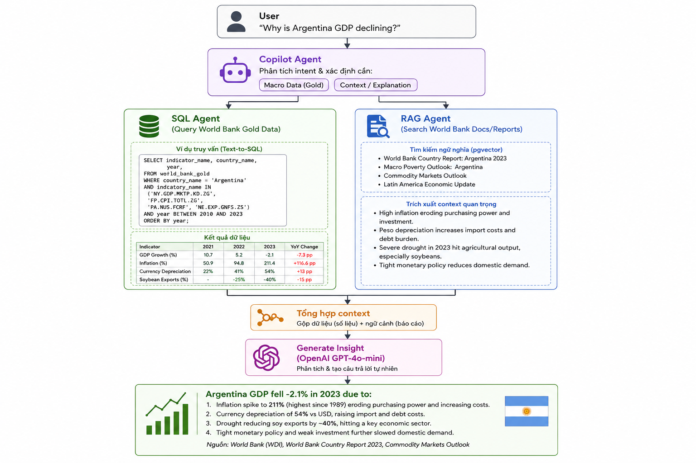
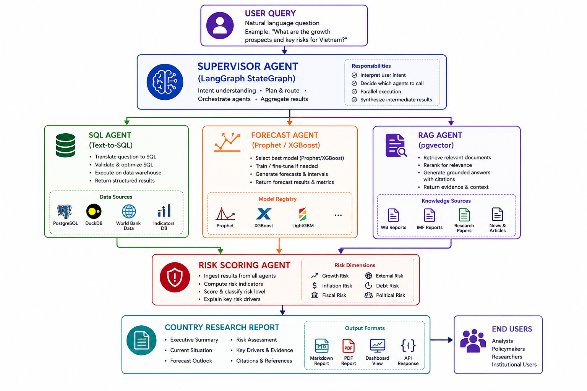
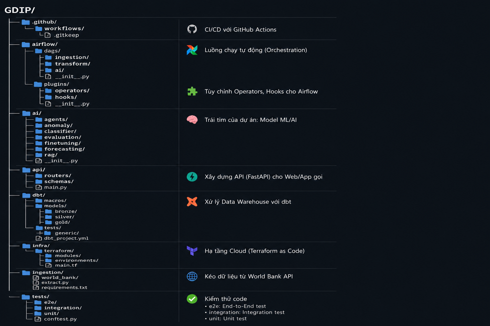

# Global Development Intelligence Platform (GDIP)

Nền tảng AI End-to-End được thiết kế để phân tích sức khỏe kinh tế vĩ mô toàn cầu, dự đoán khủng hoảng kinh tế, và cung cấp insight chuyên sâu thông qua hệ thống Multi-Agent thông minh. Toàn bộ hệ thống được xây dựng trên nguồn Dữ liệu Mở của World Bank (World Bank Open Data).

---

## 🏗️ Ngữ Cảnh Hệ Thống & Kiến Trúc Tổng Quan

GDIP được xây dựng dựa trên nền tảng Data Engineering vững chắc với Kiến trúc Medallion (Bronze, Silver, Gold), được điều phối bởi Airflow và biến đổi dữ liệu thông qua dbt. Tầng trí tuệ nhân tạo tận dụng Machine Learning để dự báo và hệ thống Multi-Agent dựa trên LangGraph để đưa ra quyết định.

### Các Trụ Cột Kiến Trúc Chính:

- **Data Layer (Tầng Dữ Liệu):** Tiêu thụ dữ liệu từ World Bank (JSON) một cách an toàn (Idempotent) vào tầng Bronze, làm sạch tại tầng Silver (CSV/Delta), và tổng hợp thành các Feature Store tại tầng Gold.
- **ML Layer (Tầng Học Máy):** Mô hình phân loại sức khỏe kinh tế có giám sát (XGBoost, LightGBM) sử dụng các đặc trưng kinh tế vĩ mô tự tinh chỉnh (lag, ratio, momentum, z-score).
- **MLOps Layer:** Theo dõi toàn bộ vòng đời mô hình qua MLflow, đánh giá theo khung Champion-Challenger với kiểm định Diebold-Mariano, và giám sát độ lệch liên tục (Data, Prediction, Concept Drift).

---

## 🤖 Tầng AI Agent & Economic Copilot

Thành phần tương tác cốt lõi của GDIP là **Economic Copilot** (Trợ lý Kinh tế), được vận hành bởi kiến trúc Multi-Agent xây dựng bằng LangGraph. Hệ thống này vượt xa các Dashboard và mô hình dự báo thông thường để chủ động tổng hợp dữ liệu và tự tạo ra insight.

### Các Agent Chuyên Trách:

1. **SQL Agent (Text-to-SQL):** Chuyển đổi ngôn ngữ tự nhiên thành câu lệnh SQL trên Gold Feature Store, kết hợp giới hạn schema (schema-constrained) để ngăn chặn rủi ro sinh mã sai (hallucinations).
2. **Forecast & Risk Agent (Dự báo & Đánh giá Rủi ro):** Kết hợp kết quả từ mô hình Machine Learning với các quy tắc chuyên gia (rule-based heuristics) để tính toán Điểm Rủi ro Kinh tế toàn diện từ 0-100.
3. **RAG Agent:** Truy xuất ngữ cảnh chuyên sâu từ các tài liệu của World Bank sử dụng cơ chế tìm kiếm lai (Hybrid search: Dense + BM25 + Cross-Encoder Reranking) tự xây dựng với pgvector.

---

## 🔄 Luồng Truy Vấn Của Người Dùng

Khi người dùng đặt các câu hỏi kinh tế phức tạp (ví dụ: _"Tại sao GDP của Argentina lại đang suy giảm?"_), hệ thống sẽ điều phối nhiều luồng truy xuất và suy luận cùng lúc.

1. **Phân tích Ý định (Intent Routing):** Supervisor Agent phân tích câu hỏi và điều hướng đến đúng các sub-agent chuyên trách.
2. **Thực thi Song song:** Việc truy vấn số liệu, tìm kiếm tài liệu ngữ nghĩa, và đánh giá điểm rủi ro diễn ra đồng thời.
3. **Tổng hợp (Synthesis):** Node LLM cuối cùng sẽ tổng hợp dữ liệu có cấu trúc, dự đoán từ ML, và ngữ cảnh tài liệu phi cấu trúc thành một báo cáo tường minh, có độ chính xác cao.

---

## 📂 Cấu Trúc Thư Mục

Repository được tổ chức theo chuẩn Production, tách biệt rõ ràng giữa Data Engineering pipelines, Machine Learning modules, AI Agents, và MLOps monitoring.

- `airflow/dags/`: Pipeline điều phối, thu thập và biến đổi dữ liệu.
- `ai/agents/`: Định nghĩa LangGraph, prompt templates, và các node agent chuyên trách.
- `ai/classifier/`: Script huấn luyện ML, feature engineering, và cross-validation.
- `ai/mlops/`: Khung đánh giá Champion-challenger, phát hiện drift, và tích hợp MLflow.
- `ai/rag/`: Tạo embedding, lưu trữ vector database, và logic truy xuất.
- `docs/`: Tài liệu kỹ thuật, sơ đồ kiến trúc, và phương pháp testing.

---
